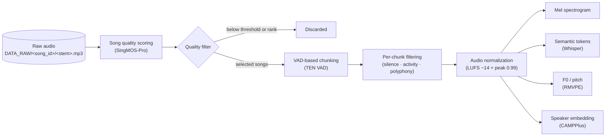
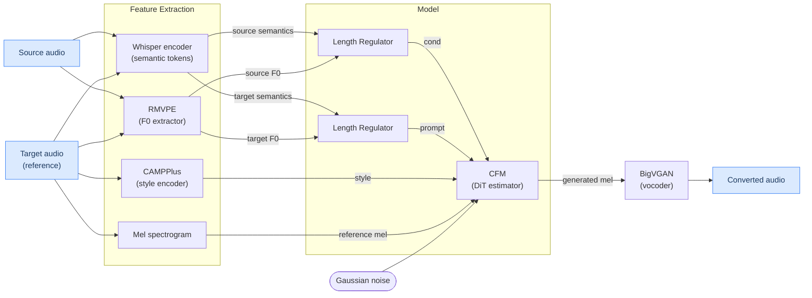

# Seed VC

[](https://maksymhalychshi2022.github.io/polyphony-seed-vc-evaluation/)
[](https://dagshub.com/maksym.halych.shi.2022/polyphony-seed-vc.mlflow/#/experiments/5/runs/412ddbda2ee94e2d9d65cb539307cbea/model-metrics)

## Dataset Preprocessing Pipeline



### Stages

1. **Song quality scoring** (`process_raw_dataset.py`) — All songs in `DATA_RAW` are loaded in parallel and scored with SingMOS-Pro averaged over 5-second chunks. Songs are ranked by score and the top-N (configurable via `params.yaml: process_raw.max_songs`) above a minimum quality threshold are selected; the rest are discarded. The selection log is saved to `preprocess_manifest.json`.

2. **VAD-based chunking** (`process_raw_dataset.py`) — The mixed stem signal for each selected song is passed through TEN VAD to find active vocal regions. Short gaps between regions are merged and each region is padded slightly; long regions are split into preferred-length chunks (default 8 s, min 1 s, max 30 s).

3. **Per-chunk filtering** (`process_raw_dataset.py`) — Each candidate chunk is validated against two criteria before writing:
   - *Mixture silence ratio*: chunk is dropped if more than 5% of frames fall below −30 dB RMS.
   - *Per-stem checks*: each stem must have ≥ 20% active VAD frames (source activity) and the residual energy (mixture minus stem) must be ≥ 15% of the mixture RMS (polyphony contrast). Stems failing either check are dropped; the chunk is dropped if no stems pass.

4. **Audio normalization** (`process_raw_dataset.py`) — Each accepted stem chunk is LUFS-normalized independently to −14 LUFS, then the stems are re-summed to rebuild the mixture, and the whole batch (stems + mixture) is peak-normalized to 0.99.

5. **Feature extraction** (four parallel DVC stages, one per feature type) — Each audio file referenced in the CSVs is processed through:
   - **Mel spectrogram** — log-mel via `MelSpectrogramExtractor`; target for the CFM model.
   - **Semantic tokens** — Whisper encoder hidden states via `WhisperFeatureExtractor`; content representation.
   - **F0 / pitch** — fundamental frequency contour via RMVPE (`F0FeatureExtractor`).
   - **Speaker embedding** — d-vector via CAMPPlus (`CampplusEmbeddingExtractor`); timbre identity.

   Results are cached as `.npy` files under `DATA_FEATURES/<type>/<audio_hash>.npy`. Unchanged files are skipped on re-runs.

---

## Model Architecture



## Training on vast.ai

Full steps to go from a fresh GPU instance to an active training run.

### 1. Provision an instance

On [vast.ai](https://vast.ai), rent a GPU instance using the **PyTorch** template (CUDA 12+, Python 3.10+). SSH into it once it boots.

### 2. Install system dependencies

`ten-vad` ships a prebuilt `.so` that links against `libc++`:

```bash
apt-get update && apt-get install -y libc++1 libc++abi1 ffmpeg
```

### 3. Install uv

```bash
curl -LsSf https://astral.sh/uv/install.sh | sh
source $HOME/.local/bin/env   # or re-open the shell
```

#### [Optional] Install go-task

```bash
curl -1sLf 'https://dl.cloudsmith.io/public/task/task/setup.deb.sh' | bash
apt install task
```

### 4. Clone the repo

```bash
git clone https://github.com/MaksymHalychShi2022/polyphony-seed-vc.git
cd polyphony-seed-vc
```

### 5. Install dependencies

```bash
uv sync
```

This installs all Python deps including `go-task-bin` (the `task` CLI) into the managed venv.

### 6. Configure environment variables

```bash
cp .env.dist .env
```

Open `.env` and fill in the required values:

| Variable                   | What to fill in                     |
| -------------------------- | ----------------------------------- |
| `MLFLOW_TRACKING_PASSWORD` | Your DagsHub access token           |
| Everything else            | Defaults work for a standard layout |

### 7. Set up DVC auth (Google Drive service account)

The DVC remote is a Google Drive folder authenticated via a service account. You need to place the service account JSON file at the repo root:

```bash
# From your local machine — copy the key file to the instance
scp gdrive_service_account_json_file_path.json root@<vast-ip>:<vast-port>:/path/to/repo/gdrive_service_account_json_file_path.json
```

The `.dvc/config` already points to this file — no further DVC config changes needed.

### 8. Pull raw data

```bash
uv run dvc pull data/raw.dvc
```

This downloads ~12 GB of raw multitrack audio from Google Drive. Run it once; subsequent runs skip already-cached files.

### 9. Run the preprocessing pipeline

```bash
uv run dvc repro
```

DVC runs all stages in order (process audio → build CSVs → extract mel/semantic/F0/embedding features) and skips any stage whose inputs haven't changed. To tune how many songs are processed, edit `params.yaml`:

```yaml
process_raw:
  max_songs: 100   # set to -1 for all songs
```

Then re-run `dvc repro` — only the affected stages will rerun.

### 10. Start training

```bash
uv run task train
```

Or with Hydra overrides:

```bash
uv run --env-file .env python -m seed_vc.train.train run_name=vast_run trainer.batch_size=2 trainer.max_steps=10000
```

Logs go to `runs/<run_name>/train.log`, TensorBoard (`runs/`), and MLflow (when `MLFLOW_TRACKING_URI` is set in `.env`).

### 11. Monitor training

```bash
# TensorBoard (port-forward 6006 in vast.ai's port settings)
uv run task tensorboard

# MLflow UI
uv run task mlflow
```

### 12. Push checkpoint to HuggingFace

```bash
# One-time login
uv run huggingface-cli login
```

**Upload the entire run directory** (checkpoints + `.hydra/` config + `train.log` + TensorBoard events):

```bash
uv run huggingface-cli upload MaksymHalych/polyphony-seed-vc \
  runs/vast_run_2026-05-05_11-06-32/ \
  . \
  --repo-type model
```

The second argument is the local path, the third is the destination inside the repo (`.` = repo root).

---

## Start demo app

```bash
task demo
```

## Evaluation

The pipeline runs in three sequential stages. Each stage writes an artifact the next stage consumes, so any stage can be re-run independently.

**Prerequisites:** feature cache populated (`dvc repro` done) and a trained checkpoint.

### Run all stages at once

```bash
uv run --env-file .env python -m eval.cli \
  --stage all \
  --split val \
  --checkpoint runs/my_run_<timestamp>/DiT_epoch_00010_step_01000.pth
```

Omit `--checkpoint` to use the pretrained HuggingFace checkpoint. Artifacts are written to `data/processed/.eval_cache/<timestamp>/`:

- `results_manifest.json` — generated audio paths and generation status per pair
- `metrics_manifest.json` — per-item and aggregate metric values
- `evaluation_report.html` — interactive HTML report with audio playback

### Run stages individually

**Stage 1 — generate audio:**

```bash
uv run --env-file .env python -m eval.cli \
  --stage generate-results \
  --split val \
  --checkpoint runs/my_run_<timestamp>/DiT_epoch_00010_step_01000.pth
```

**Stage 2 — compute metrics:**

```bash
uv run --env-file .env python -m eval.cli --stage compute-metrics --split val
```

**Stage 3 — build HTML report:**

```bash
uv run --env-file .env python -m eval.cli --stage build-report --split val
```

### Metrics

| Metric                   | Direction | Description                                                       |
| ------------------------ | --------- | ----------------------------------------------------------------- |
| `resemblyzer_similarity` | higher    | Cosine similarity between target and generated speaker embeddings |
| `f0_rmse`                | lower     | RMS error between aligned source and generated F0 contours        |
| `f0_correlation`         | higher    | Pearson correlation between source and generated F0 contours      |
| `singmos_naturalness`    | higher    | Mean SingMOS-Pro score across 5-second generated chunks           |

Disable SingMOS (slow to load) if you only need timbre/melody metrics:

```bash
uv run --env-file .env python -m eval.cli --stage compute-metrics --split val --disable-singmos
```

### Comparison report

To compare two evaluation runs side-by-side, edit the hardcoded paths at the top of `scripts/build_combined_eval_report.py`:

```python
RUN_A_DIR = ROOT / "data/processed/.eval_cache/<timestamp-A>"
RUN_B_DIR = ROOT / "data/processed/.eval_cache/<timestamp-B>"
```

Both directories must contain `results_manifest.json` and `metrics_manifest.json` (i.e. both runs must have completed through the `compute-metrics` stage). Then run:

```bash
uv run python scripts/build_combined_eval_report.py
```

The output is written to `combined-eval-report/evaluation_comparison.html` — a self-contained bundle with audio playback and per-pair metric deltas between the two runs.
